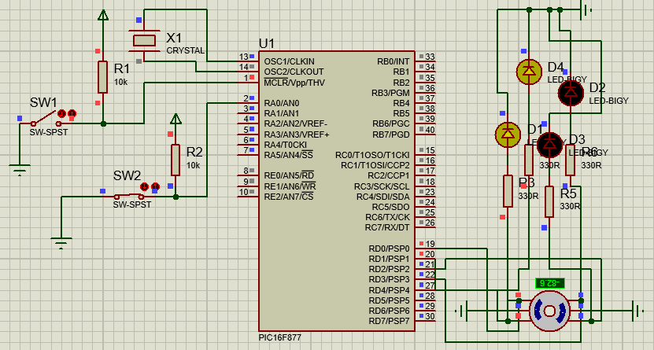

# Utiliza-o-de-Motor-de-Passo
Será apresentado um método básico de acionamento de motores de passo utilizando o PIC. 
Neste circuito a tecla determina o sentido do giro do motor, os 4 LDEs foram colocados para fim de diagnostico das bobinas do motor.

